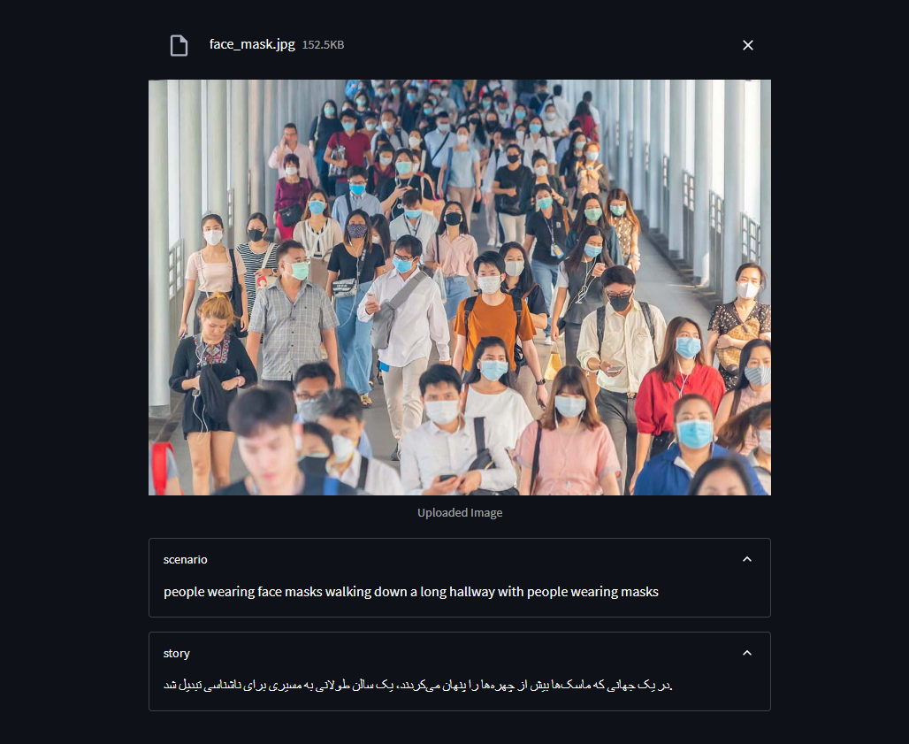

# image2audio_story
creating an audio story from an image!

## This ripo includes two programs: 

1_ image 2 audio story: this is based on 'EN' and there is in commit 2.

2_ image 2 persian story: becuse there was not a suitable tts model for persian, it has just image to story(without audio). there is in commit 3.

*Tools: HuggingFaceHub, LangChain, Streamlit*

## output

for audio story version, output.flac is the audio story.
